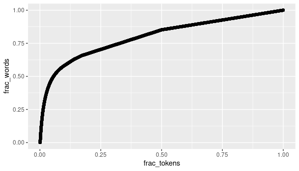
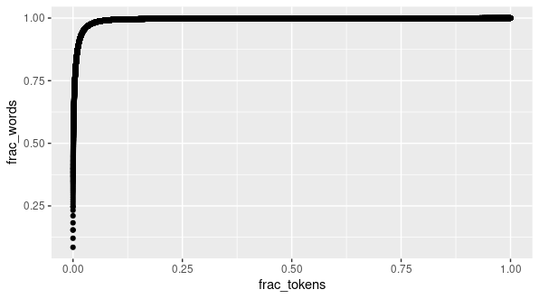

```{r, include = FALSE}
knitr::opts_chunk$set(
  collapse = TRUE,
  eval = FALSE,
  comment = "#>"
)
```

```{r setup}
library(morphemepiece)
library(wikimorphemes)
library(dplyr)
library(ggplot2)
```

This vignette shows how to use the processed words from the {wikimorphemes}
package to create a morphemepiece vocabulary and lookup table.

To make a morphemepiece vocab, start with...

 - a wordpiece vocabulary
 - a processed wikimorphemes cache
 - (optionally) a word frequency table derived from some corpus.

```{r}
# load functions to make the vocab + lookup
source("make_vocab_and_lookup.R")

# Local paths to wordpiece vocabulary, processed wikimorphemes cache, and a word
# frequency table. (I used a word frequency table derived from the wikitext-103
# corpus.) The word frequency table should have character column "word" and
# integer column "word_count".
# See the wikimorphemes package at
# https://github.com/jonthegeek/wikimorphemes
# for more detailed information.

wordpiece_vocab_path <- "/shared/BERT_checkpoints/bert_base_uncased/vocab.txt"
proc_wm_path <- "/shared/wiktionary/wikimorphemes.rds"
sample_corpus_wf_path <- "/shared/sample_corpus/word_frequency_table.rds"

# Use {wordpiece} to read vocab. Note that {wordpiece} formats the vocab as a
# named integer vector, where the name is the token and the value is the token
# id.
wp_vocab <- wordpiece::load_or_retrieve_vocab(wordpiece_vocab_path)
processed_wiktionary <- readRDS(proc_wm_path)
word_freq_tab <- readRDS(sample_corpus_wf_path)

```

Before we make a specific vocab, we can look at which morphemes are most
common over all wiktionary words to get a prioritized list.

```{r}
# for much of this process, it's more convenient to have the processed words
# unnested, with one morpheme per row. This takes a few minutes, so the unnest 
# is memoised.
# Currently, we're considering only words with pure lowercase latin characters.
# We likely will want to also include the simplified version of words with
# accented characters in this list. 
unnested_processed_wiktionary <- unnest_pw(processed_wiktionary, clean = TRUE)

# count how many wiktionary words each token appears in.
token_counts <- get_token_counts(unnested_processed_wiktionary)

utils::head(token_counts) # top token is ##s, unsurprisingly
# # A tibble: 6 x 3
#   token token_score  rank
#   <chr>       <dbl> <int>
# 1 ##s        174957     1
# 2 ##ed        39325     2
# 3 ##ing       39247     3
# 4 ##er        22431     4
# 5 un##        15747     5
# 6 ##ly        14054     6


# We rank tokens in order of frequency. We can also rank *words* in order of the
# maximum rank that their component tokens have. This shows which words would be
# covered by a token vocabulary including tokens up to some rank.

# Some words process into "non-clean" tokens (diacrits, etc.).
# Those tokens are excluded in token_counts, so will get an NA here.
# Deal with this better later, but for now, just remove those words.
# (only about 0.01% of words)
words_with_max_token_ranks <- dplyr::left_join(
  unnested_processed_wiktionary, 
  token_counts, 
  by = c("token" = "token")) %>% 
  dplyr::group_by(word) %>% 
  dplyr::summarize(max_rank = max(rank)) %>% 
  dplyr::filter(!is.na(max_rank))

# Count how many total words are covered by tokens up to some rank:

words_vs_tokens <- words_with_max_token_ranks %>% 
  dplyr::group_by(max_rank) %>% 
  dplyr::summarize(n_words = dplyr::n_distinct(word)) %>% 
  dplyr::arrange(max_rank) %>% 
  dplyr::mutate(n_words = cumsum(n_words))

# Total number of distinct tokens:
max(words_vs_tokens$max_rank)  # 189209
# Total number of distinct words:
max(words_vs_tokens$n_words)  # 638316

# plot!
words_vs_tokens %>% 
  dplyr::mutate(frac_words = n_words/max(n_words)) %>% 
  dplyr::mutate(frac_tokens = max_rank/max(max_rank)) %>% 
  ggplot2::ggplot(aes(x = frac_tokens, y = frac_words)) + 
  ggplot2::geom_point() 

```



Note that only about 5% of the morpheme tokens (out of about 189K) are needed to 
cover about 50% of the words (out of about 638K).

The above weighted each word equally, no matter how frequently it occurs.
To get a sense of word coverage by actual usage, we can weight each word by how
often it occurs in some corpus. For example, weighting words by occurrence in
the wikitext-103 corpus:

```{r}
# passing a word frequency table in (columns: word, word_count) applies weights
# to the token counts. 
token_counts_weighted <- get_token_counts(unnested_processed_wiktionary, 
                                          word_freq_tab)
# now the top token is "the", just because of how common that word is.
utils::head(token_counts_weighted)
# # A tibble: 6 x 3
#   token token_score  rank
#   <chr>       <dbl> <int>
# 1 the       6475974     1
# 2 ##s       5837241     2
# 3 ##ed      4384989     3
# 4 of        2755962     4
# 5 and       2516910     5
# 6 ##ing     2381396     6

words_with_max_token_ranks_weighted <- dplyr::left_join(
  unnested_processed_wiktionary, 
  token_counts_weighted, 
  by = c("token" = "token")) %>% 
  dplyr::group_by(word) %>% 
  dplyr::summarize(max_rank = max(rank)) %>% 
  dplyr::filter(!is.na(max_rank))

# Instead of counting how many words are covered by tokens up to some rank,
# we should count the *total weight* of words covered. For this, we join onto
# word_freq_tab again (giving words not found in the corpus a count of one):

weighted_tokens_and_words <- dplyr::left_join(
# weighted_tokens_and_words <- dplyr::inner_join(
  words_with_max_token_ranks_weighted,
  word_freq_tab,
  by = "word") %>% 
  dplyr::mutate(word_count = ifelse(is.na(word_count), 1, word_count))


words_vs_tokens_weighted <- weighted_tokens_and_words %>% 
  dplyr::group_by(max_rank) %>% 
  dplyr::summarize(n_words = sum(word_count)) %>% 
  dplyr::arrange(max_rank) %>% 
  dplyr::mutate(n_words = cumsum(n_words))

# plot!
words_vs_tokens_weighted %>% 
  dplyr::mutate(frac_words = n_words/max(n_words)) %>% 
  dplyr::mutate(frac_tokens = max_rank/max(max_rank)) %>% 
  ggplot2::ggplot(aes(x = frac_tokens, y = frac_words)) + 
  ggplot2::geom_point() 

```




The top 5% of tokens would cover over 98% of words by usage.

Now we make an actual vocabulary + lookup:

```{r}
# This constructs a MP vocabulary, starting with a WP vocabulary.
# The constructed vocabulary contains the same "fancy" tokens as WP 
# (punctuation, etc.), but replaces most (non-short, non-proper-noun) words with
# their morpheme tokens. This generally results in a core vocabulary with about
# 16K tokens. If our target vocabulary size is larger than this, additional
# tokens are added from the (ranked) list of tokens.
# The lookup contains every word in the wikipedia word list which is covered by
# (process into) the tokens in the vocabulary.
# Here, let's make two vocabularies: one "small" (minimum to ~cover WP vocab) 
# and one "large" (comparable to size of WP vocab)
vandl_small <- make_vocab_and_lookup(processed_wiktionary,
                                     wp_vocab,
                                     target_vocab_size = 0, # no extra tokens
                                     word_freq_tab = word_freq_tab)
vandl_large <- make_vocab_and_lookup(processed_wiktionary,
                                     wp_vocab,
                                     target_vocab_size = 30000,
                                     word_freq_tab = word_freq_tab)
```

The vocabulary and lookup aren't yet in our standardized forms. First, let's 
save them as standardized text files:

```{r}

text_lookup_small <- make_text_lookup(voc = vandl_small$vocab, 
                                      lu = vandl_small$lookup,
                                      word_freq_tab = word_freq_tab)

shared_dir <- "/shared/morphemepiece_vocabs/"

writeLines(text_lookup_small, file.path(shared_dir, "mp_lookup_small.txt"))
# vocab is already just a character vector
writeLines(vandl_small$vocab, file.path(shared_dir, "mp_vocab_small.txt"))

# now do large
text_lookup_large <- make_text_lookup(voc = vandl_large$vocab, 
                                      lu = vandl_large$lookup,
                                      word_freq_tab = word_freq_tab)

writeLines(text_lookup_large, file.path(shared_dir, "mp_lookup_large.txt"))
# vocab is already just a character vector
writeLines(vandl_large$vocab, file.path(shared_dir, "mp_vocab_large.txt"))

# Read back from text files to process as standard morphemepiece files:
vocab <- load_or_retrieve_vocab(file.path(shared_dir, "mp_vocab_large.txt"))
lookup <- load_or_retrieve_lookup(file.path(shared_dir, "mp_lookup_large.txt"))

morphemepiece_tokenize("Surprisingly easy", vocab, lookup)
```

## Check coverage

With these vocabularies, we can look at various measures of coverage.
For example, what (weighted) fraction of words from our corpus are covered by
the vocab/lookup?

```{r}

corpus_coverage_small <- left_join(word_freq_tab, 
                                   vandl_small$lookup, 
                                   by = "word") %>% 
  mutate(covered_lookup = !is.na(tokenization)) %>% 
  # not every word in the vocab is in the lookup; check vocab too
  mutate(covered_vocab = word %in% vandl_small$vocab) %>% 
  mutate(covered = covered_lookup | covered_vocab) %>% 
  mutate(covered_weighted = covered*word_count) 

corpus_coverage_small %>% 
  summarize(sum(covered_weighted)/sum(word_count))
# 0.9495136
```

The "small" vocabulary covers just under 95% of words from the corpus, weighted
by usage. 

```{r}

corpus_coverage_large <- left_join(word_freq_tab, 
                                   vandl_large$lookup, 
                                   by = "word") %>% 
  mutate(covered_lookup = !is.na(tokenization)) %>% 
  # not every word in the vocab is in the lookup; check vocab too
  mutate(covered_vocab = word %in% vandl_large$vocab) %>% 
  mutate(covered = covered_lookup | covered_vocab) %>% 
  mutate(covered_weighted = covered*word_count) 

corpus_coverage_large %>% 
  summarize(sum(covered_weighted)/sum(word_count))
# 0.9644623
```

The "large" vocabulary covers about 1.5% more words (weighted) than the "small"
vocabulary. 

It is useful to look at the most common words that are *not* covered
by the vocabularies:

```{r}
#large
corpus_coverage_large %>% 
  filter(!covered) %>% 
  arrange(desc(word_count)) %>% 
  utils::head(10) %>% 
  select(word, word_count)

# # A tibble: 10 x 2
#    word    word_count
#    <chr>        <int>
#  1 km           40555
#  2 los          10960
#  3 cm            9335
#  4 kg            6269
#  5 von           5467
#  6 didn          5351
#  7 beyoncé       4583
#  8 mulder        4177
#  9 doesn         2951
# 10 du            2735
```

Ah, our process (as of June 2021) has a hole: abbreviations such as "km" and 
"cm" really should be in the vocabulary, but they are missing due to not having
an "English" section in Wiktionary. We'll address this in a future update.

Other categories of uncovered words include some proper nouns, words with
diacritical marks, and partial contractions (like "didn"). 

The word "los" in this list raises an interesting question for future 
consideration: should a small set of common words in languages besides English
be included? After all, a significant number of tokens in both WP and MP are 
currently used for Asian language characters. 

## Other measures of coverage quality

Some other checks we will try include:

- For the top 1000 common words (e.g. as estimated here:
  https://xkcd.com/simplewriter/words.js), manually evaluate the quality of the
  breakdown.
- For N random covered words *without* a breakdown, manually evaluate whether
  the word should have a breakdown.


```{r}
# just for fun :-D
xkcd_words_url <- "https://xkcd.com/simplewriter/words.js"
tf <- tempfile()
system(paste("wget", xkcd_words_url, "-O", tf))
system(paste("echo >>", tf)) # add final newline

raw_words <- readLines(tf)
raw_words <- raw_words[grepl("WORDS", raw_words)]
raw_words <- stringr::str_split(raw_words, '"')[[1]]
raw_words <- raw_words[grepl("\\|", raw_words)]
words <- dplyr::tibble(top_words = stringr::str_split(raw_words, "\\|")[[1]])
# I feel lied to. There are more than 3k words in this list.
words <- words %>% 
  dplyr::mutate(tokenized = purrr::map_chr(top_words, function(w) {
    paste(names(morphemepiece_tokenize(w, vocab, lookup)), collapse = " ")[[1]]
  }) 
  )

# ss_url <- "url of mp_scratch google sheet"

# already authorized
# googlesheets4::write_sheet(words, ss_url)
# manual check, add column "is_ok"
checked_words <- googlesheets4::read_sheet(ss_url, sheet = "check common words")

# if breakdown is ok, value is "y"
mean(checked_words$is_ok == "y")
# [1] 0.9711062
# many of the exceptions can/should be fixed in wiktionary
```

Fewer than 3% of these words (about 100 total) were judged to be problematic.
For these common words, it makes sense for us to address the issues directly in
Wiktionary where possible.

For the next check, randomly pick some words of at least length 4 without a 
breakdown:

```{r}
all_words <- unique(unnested_processed_wiktionary$word)
unbroken_vocab_words <- intersect(names(vocab), all_words)
unbroken_vocab_words <- unbroken_vocab_words[nchar(unbroken_vocab_words) > 3]

# sample a few hundred
unbroken_sample <- dplyr::tibble(unbroken_word = sample(unbroken_vocab_words, 
                                                        size = 300))
# send to google sheet for manual check

# googlesheets4::write_sheet(unbroken_sample, ss_url, sheet = "unbroken_check")
# manual check, add column "is_ok"
checked_unbroken_words <- googlesheets4::read_sheet(
  ss_url, 
  sheet = "check unbroken words"
)

# if breakdown is ok, value is "y"
table(checked_unbroken_words$is_ok)
 #  ?   n   y 
 # 24  32 244 
# many of the exceptions can/should be fixed in wiktionary
```

About 10% of this sample was judged to be wrong (definitely should have a 
breakdown), and about 10% was judged to be questionable (maybe should have a
breakdown).
